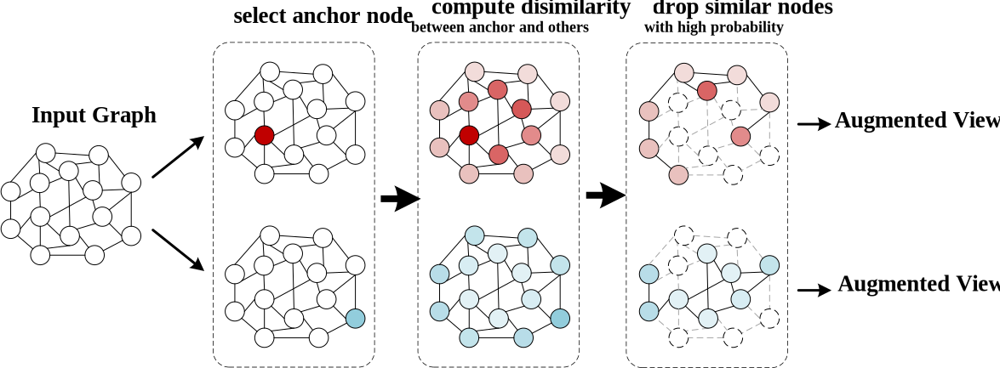
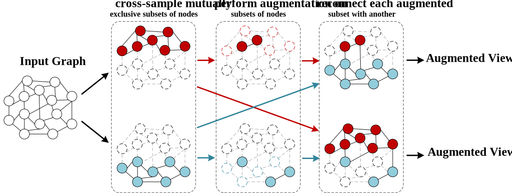

***

<h2> Graph Contrastive Learning with Constrained Graph Data Augmentation </h2>

Shaowu Xu1, Luo Wang1, [Xibin Jia](https://scholar.google.com/citations?user=0XxocmcAAAAJ&hl=en&oi=ao)1

 
1[Beijing University of Technology](https://www.bjut.edu.cn/)

***

This is the official implementation of our proposed two constraint principles for graph augmentation, LDP (low dissimilarity priority) and mutual exclusion (ME). The backbone models used in the graph classification experiment and node classification experiment are [GraphCL](https://github.com/Shen-Lab/GraphCL/tree/master) and [GCA](https://github.com/CRIPAC-DIG/GCA), respectively.

## Overview
**Abstract:** Studies on graph contrastive learning, which is an effective way of self-supervision, have achieved excellent experimental performance. 
		Most existing methods generate two augmented views, and then perform feature learning on the two views through maximizing semantic consistency.
		Nevertheless, it is still challenging to generate optimal views to facilitate the graph construction that can reveal the essential association relations among nodes by graph contrastive learning.
		Considering that the extremely high mutual information between views is prone to have a negative effect on model training, a good choice is to add constraints to the graph data augmentation process. 
		This paper proposes two constraint principles, low dissimilarity priority (**LDP**) and mutual exclusion (**ME**), to mitigate the mutual information between views and compress redundant parts of mutual information between views.
		LDP principle aims to reduce the mutual information between views at global scale, and ME principle works to reduce the mutual information at local scale. They are opposite and appropriate in different situations.

**Fig. 1** The schematic diagram of the proposed LDP principle, taking node dropping as example. The color depth of each node represents its dissimilarity with the anchor nodes, with darker colors indicating lower dissimilarity.

**Fig. 2** The schematic diagram of the proposed ME principle, taking node dropping as example. The red and blue nodes represent nodes belonging to different subsets of nodes.

## Prerequisites

The code is built with following libraries. 

**GraphCL**
- [PyTorch](https://pytorch.org/) >= 1.4
  
**GCA**
- [PyTorch](https://pytorch.org/) >= 1.8

## Usage

The implementation of the graph data augmentation module for the proposed method is now available in this repository. You can replace the corresponding code files provided in this project with the ones in [GraphCL](https://github.com/Shen-Lab/GraphCL/tree/master) or [GCA](https://github.com/CRIPAC-DIG/GCA), and use them after debugging.

We are currently organizing the complete version of the code that can run independently. Once the organization process is completed and we have tested its compatibility with other devices in our laboratory, we will gradually upload the finalized code to this repository.

We apologize for any inconvenience caused and appreciate your understanding and patience.
